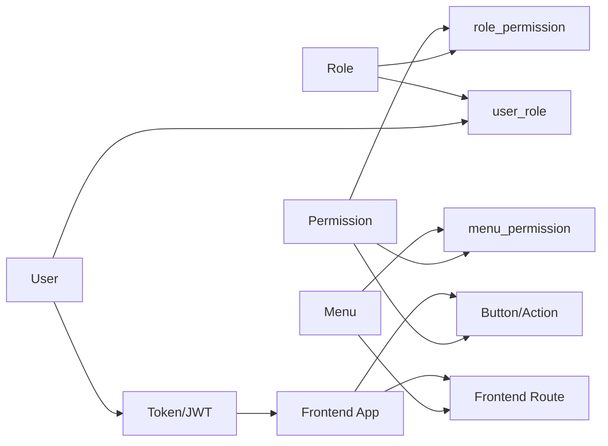

# Access Control Integration Playbook

## 1) Role-Permission-Menu Relationship



### Core model
- A user can have multiple roles.
- A role can have multiple permissions.
- A menu can require one or more permissions.
- Frontend route visibility depends on menu permissions.
- Button/action visibility depends on permission codes.

## 2) Suggested Data Contracts

### Role
```json
{
  "id": 2,
  "roleCode": "ops_manager",
  "roleName": "Ops Manager",
  "dataScope": "org_and_children",
  "status": 1,
  "permissionCodes": ["iam:role:view", "iam:permission:view"]
}
```

### Permission
```json
{
  "id": 1001,
  "code": "iam:permission:view",
  "name": "Permission View",
  "module": "identity.permission",
  "type": "menu",
  "status": 1
}
```

### Menu Route
```json
{
  "path": "/access/permission-management",
  "name": "permissionManagement",
  "component": "/access/permission-management/index",
  "meta": {
    "title": "Permission Management",
    "permissions": ["iam:permission:view"]
  }
}
```

## 3) Backend API Mapping

### Permission APIs
- `GET /api-v2/iam/permission/modules`
- `GET /api-v2/iam/permission/list`
- `GET /api-v2/iam/permission/detail`
- `POST /api-v2/iam/permission/create`
- `POST /api-v2/iam/permission/update`
- `POST /api-v2/iam/permission/delete`
- `POST /api-v2/iam/permission/batch-status`

### Role APIs
- `GET /api-v2/iam/role/list`
- `GET /api-v2/iam/role/detail`
- `POST /api-v2/iam/role/create`
- `POST /api-v2/iam/role/update`
- `POST /api-v2/iam/role/delete`
- `POST /api-v2/iam/role/assign-permissions`
- `GET /api-v2/iam/role/users`
- `POST /api-v2/iam/role/assign-users`
- `POST /api-v2/iam/role/remove-users`

## 4) End-to-End Link Checklist

### A. Auth bootstrap
- [ ] Login API returns token.
- [ ] `get-info` returns `roles` and `permissions`.
- [ ] Frontend stores permission codes in auth store.
- [ ] Dynamic routes are filtered by `meta.permissions`.

### B. Menu control
- [ ] Protected menus include `meta.permissions`.
- [ ] User without menu permission cannot see route.
- [ ] User without menu permission is redirected safely.

### C. Button control
- [ ] Buttons use `v-permission` or `v-auth`.
- [ ] Protected actions are hidden/disabled correctly.
- [ ] Backend also validates permissions (not frontend only).

### D. Permission management page
- [ ] List/search/filter works with real API response.
- [ ] Create/update/delete works and refreshes list.
- [ ] Batch enable/disable works.
- [ ] Code uniqueness is validated server-side.

### E. Role management page
- [ ] Role list/search/filter works.
- [ ] Create/update/delete role works.
- [ ] Assign permissions updates role permissions.
- [ ] Role members add/remove works.
- [ ] Data scope is stored and enforced server-side.

### F. Consistency checks
- [ ] Permission code naming convention is stable.
- [ ] No orphan menu permission references.
- [ ] Disabled role or permission takes effect immediately.
- [ ] Token refresh reflects latest permissions.

## 5) Smoke Test Script (Manual)

1. Create role `qa_operator`.
2. Assign only `iam:permission:view`.
3. Assign test user to `qa_operator`.
4. Login as test user.
5. Verify:
   - Can open permission page list.
   - Cannot create/update/delete permission.
   - Cannot open role management if no `iam:role:view`.
6. Update role by adding `iam:role:view`.
7. Re-login and verify role page visibility.
8. Remove permission and verify UI and API both reject action.

## 6) Common Integration Risks

- Permission code mismatch between frontend and backend.
- Backend returns empty list shape inconsistent with expected schema.
- Frontend route meta missing `permissions`.
- Role assignment succeeds but cache/token still stale.
- Button hidden in UI but API endpoint still not protected.

## 7) Suggested Rollout Order

1. Finalize permission code dictionary.
2. Finalize role CRUD + assign-permissions APIs.
3. Complete menu route permission mapping.
4. Enable button-level guards.
5. Add audit logs for role/permission changes.
6. Run smoke tests with least-privilege users.
